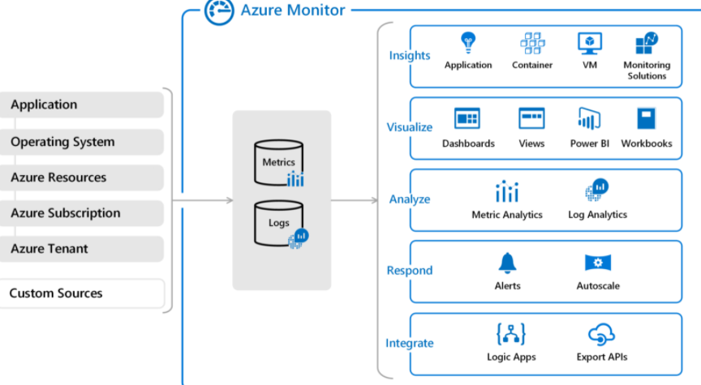

# Management tools

We'll focus on the Microsoft tools that can help accomplish some of the **DevOps** objectives and manage Azure services.

## Azure DevOps

Azure DevOps Services is a suite of services that address every stage of the software development lifecycle.

- **Azure Repos** is a centralized source-code repository where software development, DevOps engineering, and documentation professionals can publish their code for review and collaboration.
- **Azure Boards** is an agile project management suite that includes Kanban boards, reporting, and tracking ideas and work from high-level epics to work items and issues.
- **Azure Pipelines** is a CI/CD pipeline automation tool.
- **Azure Artifacts** is a repository for hosting artifacts, such as compiled source code, which can be fed into testing or deployment pipeline steps.
- **Azure Test Plans** is an automated test tool that can be used in a CI/CD pipeline to ensure quality before a software release.

Azure DevOps is more focused on enterprise development, with heavier project-management and planning tools, and finer-grained access control.

## GitHub and GitHub Actions

**GitHub** is a code decentralized source-code management tool to provide services for documentation, coordinating work, reporting and issue management, and more.

**GitHub Actions** enables workflow automation with triggers for many lifecycle events.

GitHub is a lighter-weight tool than Azure DevOps, with a focus on individual developers contributing to the open-source code.

## Azure DevTest Labs

Azure DevTest Labs provides an automated means of managing the process of building, setting up, and tearing down with services which contain your project.
Anything you can deploy in Azure via an ARM template can be provisioned through DevTests Labs.

Check your knowledge

1. Which of the following choices would not be used to automate a CI/CD process?

- Azure Pipelines
- GitHub Actions
- **Azure Boards**

*Azure Boards is an agile project-management tool. It would not be used to automate a CI/CD process.*

2. Which service could help you manage the VMs that your developers and testers need to ensure that your new app works across various operating systems?

- **Azure DevTest Labs**
- Azure Test Labs
- Azure Repos

*Azure DevTest Labs is used to manage VMs for testing, including configuration, provisioning, and automatic de-provisioning.*

3. Which service lacks features to assign individual developers tasks to work on?

- Azure Boards
- GitHub
- **Azure Pipelines**

*Azure Pipelines is a CI/CD tool for building an automated toolchain. It lacks features to assign tasks for individual developers to work on. However, it can automate other tools to assign tasks to users.*

## Management tools

There are two macro-categories of management tools: **visual** and **code-based** tools.

### The Azure portal and Azure Modile app

A user interface, you can access virtually every feature of Azure. The Azure portal provides a friendly, graphical UI to view all the services you're using, create new services, configure your services, and view reports.

### Azure PowerShell and Azure CLI

Tools that enable you to call the Azure Rest API to perform every possible management task in Azure. Commands can be executed independently or combined into a script file and executed together to orchestrate:

- The routine setup, teardown, and maintenance of a single resource or multiple connected resources.
- The deployment of an entire infrastructure, which might contain dozens or hundreds of resources, from *imperative* code.

### ARM templates

By usign Azure Resource Manager (ARM) templates you can describe the resource you want to use in a *declarative* JSON format.

Check your knowledge

1. As an administrator, you need to retrieve the IP address from a particular VM by using Bash. Which of the following tools should you use?

- ARM templates
- Azure PowerShell
- The Azure portal
- **The Azure CLI**

*The Azure CLI enables you to use Bash to run one-off tasks on Azure.*

2. You're a developer who needs to set up your first VM to host a process that runs nightly. Which of the following tools is your best choice?

- ARM templates
- Azure PowerShell
- **The Azure portal**
- The Azure CLI

*The Azure portal is a great place for newcomers to learn about Azure and set up their first resources.*

3. What is the best infrastructure-as-code option for quickly and reliably setting up your entire cloud infrastructure declaratively?

- **ARM templates**
- Azure PowerShell
- The Azure portal
- The Azure CLI

*ARM templates are the best infrastructure-as-code option for quickly and reliably setting up your entire cloud infrastructure declaratively.*

## Monitoring

Modern software systems running in the cloud are complex, and gaining visibility into the health and performance of your application-hosting environment across all of its layers of services is challenging.

### Azure Advisor

Azure Advisor evaluates your Azure resources and makes recommendations to help improve reliability, security, and performance, achieve operational excellence, and reduce costs. It helps you to save time on **cloud optimization**. Recommendations are divided into five categories:

- Reliability: Used to ensure and improve the continuity of your business-critical applications.
- Security: Used to detect threats and vulnerabilities that might lead to security breaches.
- Performance: Used to improve the speed of your applications.
- Cost: Used to optimize and reduce your overall Azure spending.
- Operational Excellence: Used to help you achieve process and workflow efficiency, resource manageability, and deployment best practices.

### Azure Monitor

Azure Monitor is a platform for collecting, analyizing, visualizing and potentially taking action based on the metric and logging data from your entire Azure and on-premises environment.

The following diagram illustrates just how comprehensive Azure Monitor is.

### Azure Service Health

Azure Service Health provides a personalized view of the health of the Azure services, regions, and resources you rely on. Service Health helps you keep an eye on several event types:

- Service issues are problems in Azure, such as outages, that affect you right now. You can drill down to the affected services, regions, updates from your engineering teams, and find ways to share and track the latest information.
- Planned maintenance events can affect your availability. You can drill down to the affected services, regions, and details to show how an event will affect you and what you need to do. Most of these events occur without any impact to you and aren't shown here. In the rare case that a reboot is required, Service Health allows you to choose when to perform the maintenance to minimize the downtime.
- Health advisories are issues that require you to act to avoid service interruption, including service retirements and breaking changes. Health advisories are announced far in advance to allow you to plan.

Check your knowledge

1. You want to be alerted when new recommendations to improve your cloud environment are available. Which service will do this?

- Azure Advisor
- Azure Monitor
- **Azure Service Health**

*Azure Advisor can alert you when new recommendations are available.*

2. Which service provides official outage root cause analyses (RCAs) for Azure incidents?

- Azure Advisor
- Azure Monitor
- **Azure Service Health**

*Azure Service Health provides incident history and RCAs to share with your stakeholders.*

3. Which service is a platform that powers Application Insights, monitoring for VMs, containers, and Kubernetes?

- Azure Advisor
- **Azure Monitor**
- Azure Service Health

Azure Monitor is the platform used by Application Insights.

