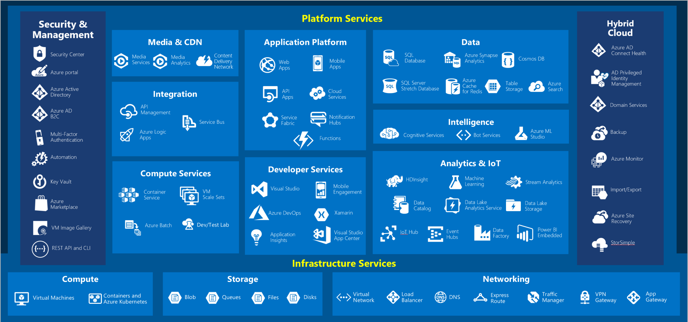
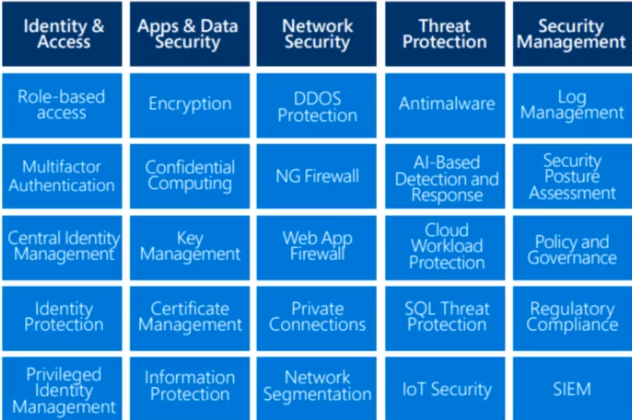

# Who this course is for

Candidates *with non-technical* backgrounds who are interested in learning about the cloud. Candidates *with technical* backgrounds who are interested in getting more advanced certs in the future.

Exam syllabus [here](exam-az-900-microsoft-azure-fundamentals-skills-measured.pdf)

## What is Azure?

Azure is a set of cloud services that help your organization meet your current and future business challenges.
It offers everything you need to  build, manage, and deploy applications on a massive global network.

Azure main pillars:

- Continuous innovation
- You choose
- Hybrid cloud
- Trust

## How does it work?

Azure use virtualization on a massive scale to abstract physical resources to the users. Each Azure data center has many racks filled with servers and each servers includes a hypervisor to run multiple virtual machines and services. All of these servers are connected to a network switch providing connectivity. A special server in the rack contains a special piece of software called a *Fabric Controller*. Each Fabric Controller is then connected to another special component known as the *Orchestrator*, which is responsible for managing everything that happens in Azure including users requests. Users make requests using the *Orchestrator Web API* thorugh different tools, including the Azure portal or CLI.

### What is the Azure Portal?

The [Azure portal](https://portal.azure.com/) is a console that provides an alternative to the command-line tools.
Through the portal you can

- Build, manage and monitor your resources
- Create dashboard for custom views of resources
- Configure accessibility options for an optimal experience

The Azure portal is designed for resiliency, continuous availability and improvement; it mantains a presence in every Azure DC.

### What is the Azure Marketplace?

[Azure Marketplace](https://azuremarketplace.microsoft.com/)  connects users with Microsoft partners, independent software vendors, and startups that are offering their solutions and services, which are optimized to run on Azure. All solutions and services are certified to run on Azure.

## Azure services

Azure has such an extensive array
of services and features. we can divide them into 10 main categories:

- Compute

These cloud services let you scale your computing capability on demand while only paying for what you use. Add virtual machines as needed or scale your company's app services for web and mobile apps.

- Networking

These features let you connect your cloud and on-premise infrastructure in order to bring the best possible experience to your customers.

- Storage

Whether it's disk, file, blob, or archival storage, these services let you scale your data and app storage needs in a secure fashion.

- Mobile

With the mobile services, you can build and deploy cross-platform and native apps for any mobile device, send notifications, use Xamarin to build cloud-powered apps, and take advantage of cognitive services to make your app smarter.

- Databases

Choose from a variety of proprietary and open source database engines to bring and manage your databases to the cloud.

- Web

These services help you build, deploy, manage, and scale your web applications.

- Internet of Things

Use these features to connect, monitor, and manage all of your IoT assets. Analyze the data as it arrives from sensors and then take meaningful action with it.

- Big data

When you have large volumes of data, these open source cluster services will help you run  analytics at a massive scale and make data drive decisions.

- AI

Use your existing data to forecast future behaviors based on these AI services. Use machine learning to build, train, and deploy models to the cloud.

- DevOps

DevOps brings together people, processes, and technology by automating software delivery to provide continuous value to your users.

Here's a big-picture view of the available services and features in Azure.

Further details on Azure services [here](1_AzureServices.md).

  

     Check your knowledge
  

1. True or false: You need to purchase an Azure account before you can use any Azure resources.

- False
- **True**

_You can use a free Azure account or a Microsoft Learn sandbox to create resource_

2. What is meant by cloud computing?

- **Delivery of computing services over the internet.**
-Setting up your own datacenter
-Using the internet

_Cloud computing is the delivery of computing services over the internet, which is otherwise known as the cloud_

3. What is not a reason to move to the cloud?

- Faster innovation
- **A limited pool of services**
- Speech recognition and other cognitive services

_The cloud offers a nearly limitless pool of raw compute, storage, and networking components to help you deliver innovative and novel user experiences quickly._

## Azure fundamental concepts

There are three different cloud models: public, private, and hybrid cloud.

| Deployment model | Description |  |
| - | - | - |
| Public cloud | Services are offered over the public internet and available to anyone who wants to purchase them. Cloud resources, such as servers and storage, are owned and operated by a third-party cloud service provider, and delivered over the internet. | No capital expenditures to scale up. Applications can be quickly provisioned and deprovisioned. Organizations pay only for what they use.
| Private cloud | A private cloud consists of computing resources used exclusively by users from one business or organization. A private cloud can be physically located at your organization's on-site (on-premises) datacenter, or it can be hosted by a third-party service provider. | Hardware must be purchased for start-up and maintenance. Organizations have complete control over resources and security. Organizations are responsible for hardware maintenance and updates.
| Hybrid cloud | A hybrid cloud is a computing environment that combines a public cloud and a private cloud by allowing data and applications to be shared between them. | Provides the most flexibility. Organizations determine where to run their applications. Organizations control security, compliance, or legal requirements.

### Cloud computing advantages

There are several advantages that a cloud environment has over a physical environment:

- High availability
- Scalability
- Elasticity
- Agility
- Geo-distribution
- Disaster recovery

Cloud computing is a **consumption-based model**.
Cloud service providers operate on a consumption-based model, which means that end users only pay for the resources that they use. Whatever they use is what they pay for.A consumption-based model has many benefits, including:

- No upfront costs.
- No need to purchase and manage costly infrastructure that users might not use to its fullest.
- The ability to pay for additional resources when they are needed.
- The ability to stop paying for resources that are no longer needed.

## Cloud Services

Azure offers different *cloud service models*, for instance: IaaS, PaaS, SaaS.

The following illustration demonstrates the services that might run in each of the cloud service models.

  

    Check your knowledge
  

1. Which of the following choices isn't a cloud computing category?

- **Networking-as-a-Service (NaaS)**
- Platform-as-a-Service (PaaS)
- Infrastructure-as-a-Service (IaaS)
- Software-as-a-Service (SaaS)

_NaaS isn't a cloud computing category._

2. Which of the following statements is true?

- With Operating Expenses (OpEx), you are responsible for purchasing and maintaining your computing resources.
- **With Operating Expenses (OpEx), you are only responsible for the computing resources that you use.**
- With Capital Expenses (CapEx), you are only responsible for the computing resources that you use.

_With Operating Expenses (OpEx), you are only responsible for the computing resources that you use._

3. Which of the following options isn't a type of cloud computing?

- **Distributed cloud**
- Hybrid cloud
- Private cloud
- Public cloud

_A distributed cloud isn't a valid type of cloud computing._

4. Which of the following choices isn't a benefit of using cloud services?

- Scalability
- Disaster recovery
- High availability
- **Geographic isolation**

_You can choose to create resources in a single region; however, one of the primary advantages to cloud computing is geographic distribution._

## Azure architectural concepts

In this section we want to explain the following concepts:

- Azure subscriptions and management groups
- Azure resources, resource groups, and Azure Resource Manager.
- Azure regions, region pairs, and availability zones.

### Azure subscriptions, management groups, and resources

- **Resources**: Resources are instances of services that you create, like virtual machines, storage, or SQL databases.
- **Resource groups**: Resources are combined into resource groups, which act as a logical container into which Azure resources like web apps, databases, and storage accounts are deployed and managed.
- **Subscriptions**: A subscription groups together user accounts and the resources that have been created by those user accounts. For each subscription, there are limits or quotas on the amount of resources that you can create and use. Organizations can use subscriptions to manage costs and the resources that are created by users, teams, or projects.
- **Management groups**: These groups help you manage access, policy, and compliance for multiple subscriptions. All subscriptions in a management group automatically inherit the conditions applied to the management group.

The following image shows the top-down hierarchy of organization:

### Azure regions, availability zones and region pairs

Azure is made up of datacenters located around the globe, such datacenters aren't exposed to users directly. Instead, Azure organizes them into **regions**.
Resources are therefore created in regions. Some services are only available in certain regions, such as specific VM sizes or storage types. There are also some global Azure services that don't require you to select a particular region, such as Azure Active Directory, Azure Traffic Manager, and Azure DNS.  Azure has specialized regions that you might want to use when you build out your applications for compliance or legal purposes.

**Availability zones** ensure your services and data to be redundant so you can protect your information in case of failure. Availability zones are physically separate datacenters within an Azure region. Note that not every region has support for availability zones. You can use AZs to run mission-critical services but keep in mind that there could be a cost to duplicating your services and transferring data between zones.

Moreover, each Azure region is always **paired** with another region **within the same geography** (such as US, Europe, or Asia) at least 300 miles away. This approach allows for the replication of resources (such as VM storage) across a geography that helps reduce the likelihood of interruptions because of events such as natural disasters, civil unrest, power outages, or physical network outages that affect both regions at once. If a region in a pair was affected by a natural disaster, for instance, services would automatically failover to the other region in its region pair.

Additional advantages of **region pairs**:

- Data connection between region pairs is the highest speed available.
- If an extensive Azure outage occurs, one region out of every pair is prioritized to make sure at least one is restored as quickly as possible for applications hosted in that region pair.
- Planned Azure updates are rolled out to paired regions one region at a time to minimize downtime and risk of application outage.
- Data continues to reside within the same geography as its pair (except for Brazil South) for tax- and law-enforcement jurisdiction purposes.

### Azure resources and Azure Resource Manager

A **resource** consists in a manageable item that's available through Azure. Virtual machines (VMs), storage accounts, web apps, databases, and virtual networks are examples of resources. **Resource groups** is a logical container for resources deployed on Azure. Resources groups can help in:

- Logical grouping
- Resource life cycle
- Authorization

Further details about AZs [here](https://docs.microsoft.com/en-us/azure/availability-zones/az-overview)

**Azure Resource Manager** ([ARM](https://docs.microsoft.com/en-us/azure/azure-resource-manager/templates/)) provides a management layer that enables you to create, update, and delete resources in your account. With Resource Manager, you can:

- Manage your infrastructure through declarative templates rather than scripts. A Resource Manager template is a JSON file that defines what you want to deploy to Azure.
- Deploy, manage, and monitor all the resources for your solution as a group, rather than handling these resources individually.
- Redeploy your solution throughout the development life cycle and have confidence your resources are deployed in a consistent state.
- Define the dependencies between resources so they're deployed in the correct order.
- Apply access control to all services because RBAC is natively integrated into the management platform.
- Apply tags to resources to logically organize all the resources in your subscription.
- Clarify your organization's billing by viewing costs for a group of resources that share the same tag.

A **subscription** provides you with authenticated and authorized access to Azure products and services. It also allows you to provision resources. An account can have one subscription or multiple subscriptions that have different billing models and to which you apply different access-management policies. There are two types of subscription boundaries that you can use:

- billing boundary
- access control boundary

You might want to create additional subscriptions for resource and billing management purposes or subscription limits. If you have multiple subscriptions, you can organize them into **invoice sections**.

 Azure **management groups** provide a level of scope above subscriptions. You organize subscriptions into containers called management groups and apply your governance conditions to the management groups. Important facts about management groups:

- 10,000 management groups can be supported in a single directory.
- A management group tree can support up to six levels of depth. This limit doesn't include the root level or the subscription level.
- Each management group and subscription can support only one parent.
- Each management group can have many children.
- All subscriptions and management groups are within a single hierarchy in each directory.

  
 
    Check your knowledge
 

1. Which of the following can be used to manage governance across multiple Azure subscriptions?

- Azure initiatives
- **Management groups**
- Resource groups

*Management groups facilitate the hierarchical ordering of Azure resources into collections, at a level of scope above subscriptions. Distinct governance conditions can be applied to each management group, with Azure Policy and Azure role-based access controls, to manage Azure subscriptions effectively. The resources and subscriptions assigned to a management group automatically inherit the conditions applied to the management group.*

2. Which of the following is a logical unit of Azure services that links to an Azure account?

- **Azure subscription**
- Management group
- Resource group
- Public cloud

*An Azure subscription is a logical unit of Azure services that links to an Azure account.*

3. Which of the following features doesn't apply to resource groups?

- Resources can be in only one resource group.
- Role-based access control can be applied to the resource group.
- **Resource groups can be nested.**

*It does not apply, as resource groups can't be nested.*

4. Which of the following statements is a valid statement about an Azure subscription?

- Using Azure doesn't require a subscription.
- **An Azure subscription is a logical unit of Azure services.**

*A subscription is a set of Azure services bundled together for tracking and billing purposes.*

### Core Azure services

- [Azure Compute](2_ComputeServices.md)
- [Azure Networking](2_NetworkingServices.md)
- [Azure Storage](2_StorageServices.md)
- [Azure database and analytics](2_db-analyticsServices.md)

### Core solutions and management tools

- [Internet of Things](3_iot.md)
- [Artificial Intelligence](3_AI.md)
- [Serverless](3_serverless.md)
- [DevOps, Management, monitoring Tools](3_tools.md)

## Security

Azure applyes **security in depth** paradigm to protect your services and resources.

That means every layer is protected, for instance:

- data - virtual network endpoint
- Application - API Management
- Compute - limite Remote Desktop access, Windows update
- Network - DDoS, Fiewalls
- Identity & access - Azure AD
- Physical - Door locks and key cards

You've got multiple points to check and secure your applications.

Many Azure services include built-in security features. **Azure Security Center** is a monitoring service that provides visibility of your *security posture* across all of your services, both on Azure and on-premises. The term security posture refers to cybersecurity policies and controls, as well as how well you can predict, prevent, and respond to security threats.

**Secure score** is a measurement of an organization's security posture; it helps you to:

- Report on the current state of your organization's security posture.
- Improve your security posture by providing discoverability, visibility, guidance, and control.
- Compare with benchmarks and establish key performance indicators (KPIs).

**Azure Sentinel** is Microsoft's cloud-based SIEM system. It uses intelligent security analytics and threat analysis. It enables you to:

- Collect cloud data at scale and [connect different data sources and logs](https://docs.microsoft.com/en-us/azure/sentinel/connect-data-sources)
- Detect previously undetected threats
- Investigate threats with artificial intelligence
- Respond to incidents rapidly

**Azure Key Vault** enables you to store application's secrets in a central location. It provides secure access to sensitive information by providing access control and logging capabilities. It can help you to:

- Manage secret, eg: tokens, passwords, API Keys, etc.
- Manage encryption keys
- Manage SSL/TLS certificates for both clound and on-prem resources
- Store secrets backed by HSMs

## Network Security

**Azure Firewall** is a managed, cloud-based, intelligent network security service that helps protect resources in your Azure virtual networks. Azure Firewall is a stateful firewall.

A stateful firewall analyzes the complete context of a network connection, not just an individual packet of network traffic. Azure Firewall features high availability and unrestricted cloud scalability. The service is integrated with Azure Monitor to enable logging and analytics.

A **Network security group (NSG)** enables you to filter network traffic to and from Azure resources within an Azure virtual network. You can think of NSGs like an internal firewall. An NSG can contain multiple inbound and outbound security rules that enable you to filter traffic to and from resources by source and destination IP address, port, and protocol.

    

Check your knowledge
    

1. An attacker can bring down your website by sending a large volume of network traffic to your servers. Which Azure service can help Tailwind Traders protect its App Service instance from this kind of attack?

- Azure Firewall
- Network security groups
- **Azure DDoS Protection**

*DDoS Protection helps protect your Azure resources from DDoS attacks. A DDoS attack attempts to overwhelm and exhaust an application's resources, making the application slow or unresponsive to legitimate users.*

2. What's the best way for Tailwind Traders to limit all outbound traffic from VMs to known hosts?

- Configure Azure DDoS Protection to limit network access to trusted ports and hosts.
- **Create application rules in Azure Firewall.**
- Ensure that all running applications communicate with only trusted ports and hosts.

*Azure Firewall enables you to limit outbound HTTP/S traffic to a specified list of fully qualified domain names (FQDNs).*

3. How can Tailwind Traders most easily implement a deny by default policy so that VMs can't connect to each other?

- Allocate each VM on its own virtual network.
- **Create a network security group rule that prevents access from another VM on the same network.**
- Configure Azure DDoS Protection to limit network access within the virtual network.

*A network security group rule enables you to filter traffic to and from resources by source and destination IP address, port, and protocol.*

## Identity, Privacy, Governance

### Authentication

For on-premises environments, Active Directory running on Windows Server provides an identity and access management service that's managed by your own organization.

**Azure Active Directory (AD)** is Microsoft's cloud-based identity and access management service. With Azure AD, you control the identity accounts, but Microsoft ensures that the service is available globally. Addiotionally Azure AD can detect sign-in attempts from unexpected locations or unknown devices.

A *tenant* is a representation of an organization. A tenant is typically separated from other tenants and has its own identity.

Azure AD helps users access both external and internal resources:

- *External resources* might include Microsoft Office 365, the Azure portal, and thousands of other software as a service (SaaS) applications
- *Internal resources* might include apps on your corporate network and intranet, along with any cloud applications developed within your organization.

**Azure AD Connect** synchronizes user identities between on-premises Active Directory and Azure AD. Azure AD Connect synchronizes changes between both identity systems, so you can use features like SSO, multifactor authentication, and self-service password reset under both systems. Self-service password reset prevents users from using known compromised passwords.

**Azure AD Multi-Factor Authentication** is a Microsoft service that provides multifactor authentication capabilities. Azure AD Multi-Factor Authentication enables users to choose an additional form of authentication during sign-in.

**Conditional Access** lets you to to allow (or deny) access to resources based on identity signals. Conditional Access also provides a more granular multifactor authentication experience for users. Conditional Access collects signals from the user, makes decisions based on those signals, and then enforces that decision by allowing or denying the access request or challenging for a multifactor authentication response.

It requires Azure AD Premium P1 or P2 license or a MS 365 Business Premium license.

### Governance

The concept of governance is basically a body or a group of people who govern or set the rules or policies across a larger group of people. Azure allows you to go in there and programmatically configured these rules. So when we were talking in the first section of this course about subscriptions and management groups, that is one form of governance.

And so this is what for purpose of the **Azure policy** tool, we can also look at this in the context of compliance.

Azure Policy lets you to create your own custom policies or you can use a set of built-in policies, eg.:

- Allowed services SKUs
- Allowd locations
- Apply tag and its default value
- Not allowed resource type

Another governance related feature is Azure **Blueprint**. Blueprints are basically a set of templates that you can create that contain users in roles and policies. Every time you create a new subscription you can use one of them.

## Pricing
